# INSIGHT TRACKER: URBAN FLOOD NOWCASTING SYSTEM
## Smart India Hackathon (SIH) 2026 ? Problem Statement ID: 26085
**Ministry:** Ministry of Earth Sciences (MoES) / National Centre for Medium Range Weather Forecasting (NCMRWF)  
**Team:** Team Kairos | **Team Lead:** Yashwanth N | **Domain Benchmark:** Greater Chennai Corporation (GCC)

---

## 1. EXECUTIVE SYSTEM ARCHITECTURE FLOWCHART

```mermaid
flowchart TD
    subgraph SENSORS["Layer 0: Multi-Sensor Ingestion Fabric"]
        R1["IMD Doppler Radar (Meenambakkam S-Band)"]
        R2["ISRO Sriharikota DWR (Eliminates Blind Cone)"]
        G1["35+ GCC Municipal Rain Gauges (All 15 Zones)"]
        C1["Telecom Microwave Links (CML - 12,000+ Jio/Airtel)"]
        N1["NCMRWF NCUM-R 4km OPeNDAP Remote Slicer"]
        S1["INSAT-3DS Satellite Hydro-Estimator"]
    end

    subgraph FUSION["Precision Data Fusion & Calibration"]
        KF["2D-Var Multi-Sensor Kalman Fusion (Gaspari-Cohn <38ms)"]
        ZR["Maritime Z-R Calibration (Z = 130 R^1.4 / K_dp)"]
    end

    subgraph NOWCAST["Layer 0: Atmospheric Nowcasting Engine"]
        OF["Farneb?ck Optical Flow Advection (T+15m to T+180m)"]
        STOCH["1-Min Stochastic Cascade Sub-Stepping (P10 / P50 / P90)"]
        SR["Physics-Guided 100m Super-Resolution (DEM & Coast SBF)"]
        DISAGG["Mass-Conservative Street Disaggregation (7,894 Streets)"]
    end

    subgraph HYDRO["Layer 1 & 2: Micro-Topography & Surcharge Hydraulics"]
        DEM["Cartosat 10m DEM + Wang & Liu Pit-Filling"]
        SLOPE["D8 Flow Routing & Street Slope S0"]
        PI_GNN["1D Directed Multigraph Pipe Surcharge Engine (PySWMM)"]
        WASTE["Dynamic Solid Waste Clogging Index (mu_clog 0-80%)"]
    end

    subgraph ACTION["Layer 3 & 4: Tactical Web GIS Command Twin"]
        MAP["MapLibre / Leaflet Dark Command Twin (Port 8000)"]
        SLIDER["0-180 Min Dynamic Time Slider (1.5s Auto-Play)"]
        INSPECT["Surcharge Diagnostic Inspector (Delta h, Q_backflow)"]
        ASTAR["First Responder A* Safe Routing (Ambulance, NDRF, Car)"]
    end

    SENSORS --> FUSION
    FUSION --> NOWCAST
    NOWCAST --> HYDRO
    HYDRO --> ACTION
```



---

## 2. SUGGESTED PROJECT BRANDING & NAME OPTIONS

| # | Proposed Name | Scientific & Cultural Meaning | Strategic Advantage for SIH Jury |
|---|---|---|---|
| **1** | **KAIROS** *(Current Flagship)* | *Ancient Greek:* The opportune, decisive moment where timely action prevents catastrophe. **K**inematic **A**dvection & **I**nundation **R**eal-Time **O**perational **S**urrogate. | Sounds high-tech, international, and memorable for emergency decision-making. |
| **2** | **VARUNA-TWIN** | *Vedic Tradition:* Named after *Varuna*, the deity of celestial oceans and atmospheric rainfall. **V**ectorized **A**tmospheric-to-**R**oad **U**rban **N**owcasting **A**rchitecture. | Deeply grounded in Indian heritage and Earth Sciences Ministry ethos. |
| **3** | **JAL-NETRA** | *Meaning:* "The Water Eye" ? symbolizes our multi-sensor situational vision fusing radar, cell towers, and ward gauges. | Highly relatable to disaster management authorities (NDRF/TNSDMA). |
| **4** | **PRAVAHA-AI** | *Meaning:* "Continuous Flow" ? captures hydraulic streamflow dynamics and sub-second computational throughput. | Emphasizes fluid physics and AI surrogate speed. |
| **5** | **MEGH-DRISHTI** | *Meaning:* "Cloud Vision" ? highlights our Doppler radar advection and storm tracking engine. | Clear and self-explanatory for meteorological presentations. |

---

## 3. MASTER COMPONENT & MILESTONE TRACKING MATRIX

```mermaid
gantt
    title KAIROS Implementation Milestones
    dateFormat  YYYY-MM-DD
    section Layer 0 Rainfall
    IMD Radar & AWS Ingestion Scraper        :done, m1, 2026-09-01, 2026-09-05
    Optical Flow Advection (T+15 to T+180m)  :done, m2, 2026-09-05, 2026-09-08
    Mass-Conservative Street Disaggregation  :done, m3, 2026-09-08, 2026-09-10
    Brandes & KED Bias Calibration           :done, m4, 2026-09-10, 2026-09-12
    GCC 35+ Ward Gauges & ISRO Radar         :done, m5, 2026-09-13, 2026-09-15
    NCMRWF OPeNDAP 4km Remote Slicer         :done, m6, 2026-09-15, 2026-09-16
    CML Cell Tower Attenuation Engine        :done, m7, 2026-09-16, 2026-09-17
    1-Min Stochastic Ensemble Sub-Stepping   :done, m8, 2026-09-17, 2026-09-18
    Physics 100m Super-Resolution (0% Error) :done, m9, 2026-09-17, 2026-09-18
    Multi-Sensor 2D-Var Kalman Fusion        :done, m10, 2026-09-17, 2026-09-18
    section Web GIS Command Twin
    Tactical Dark UI & Leaflet Viewport      :done, f1, 2026-09-08, 2026-09-11
    0-180 Min Scrub Slider & Playback Loop   :done, f2, 2026-09-11, 2026-09-12
    A* Emergency Vehicle Routing Simulator   :done, f3, 2026-09-12, 2026-09-13
    Dynamic Solid Waste Clogging Slider      :done, f4, 2026-09-13, 2026-09-14
    section Next Steps
    Layer 1: Cartosat DEM & Wang-Liu Pits    :active, l1, 2026-09-18, 2026-09-21
    Layer 2: 1D PySWMM Surcharge Coupling     :l2, 2026-09-21, 2026-09-25
```

---

## 4. SCIENTIFIC ACCURACY & VERIFICATION STATUS

### Automated Test Suite: 31/31 Tests Passing (100% Success Rate)
Executed via `pytest tests/ -v` in **2.31 seconds**:
- **Ingestion & Radar Processing (5 Tests):** Live IMD GIF decoding, 15-bin SRI palette, seamless offline fallback, AWS station polling, GPM NetCDF loading.
- **Storm Motion Nowcasting (2 Tests):** 6 forward horizons in $<2.8	ext{ ms}$, 3-sweep temporal fusion.
- **Mass-Conservative Disaggregation (3 Tests):** All 7,894 GCC street segments mapped, $\le 0.000000\%$ volume discrepancy.
- **Gauge-Radar Calibration (2 Tests):** Brandes Log-Gaussian and Kriging with External Drift (KED).
- **Pipeline Integration (1 Test):** End-to-end execution.
- **Corner & Adversarial Boundary Tests (6 Tests):** Zero rainfall, single station offline, extreme 150 mm/hr cloudburst, empty frames.
- **Real-World Storm Simulations (2 Tests):** 2015 Chennai Flood peak (329 mm/day), Cyclone Michaung (95 mm/hr peak).
- **Frontier Precision Suite (6 Tests):**
  - CML ITU-R P.838-3 power-law inversion ($R = (k/a)^{1/b}$).
  - 15 Chennai telecom microwave backhaul links.
  - 1-Minute continuous sub-stepping (60/60 discrete frames).
  - Probabilistic quantiles ($P_{10} \le P_{50} \le P_{90}$).
  - Topographical 100m super-resolution with strict $0.000000\%$ mass conservation.
  - Multi-Sensor 2D-Var Kalman Fusion with Gaspari-Cohn localization.

---

## 5. DOCUMENTATION & ARTIFACT DIRECTORY

- **Institutional Requisition Portfolio:** [`research_reports/institutional_data_requisition_letters.md`](research_reports/institutional_data_requisition_letters.md)  
  *4 formal GoI-compliant letters (IMD, NCMRWF, TNSDMA, GCC) + NDA Annexure A + Interoperability Specs + Ready-to-Send Email drafts.*
- **Ultra-Precision AI Roadmap:** [`research_reports/ultra_precision_rainfall_roadmap.md`](research_reports/ultra_precision_rainfall_roadmap.md)  
  *Nature 2023 NowcastNet, CVPR 2024 DiffCast, DeepMind MetNet-3, PySteps 1.4+, and CML cell tower sensing.*
- **Nowcasting Accuracy Benchmarking Audit:** [`research_reports/nowcasting_accuracy_benchmarking_audit.md`](research_reports/nowcasting_accuracy_benchmarking_audit.md)  
  *CSI, FSS, RMSE, lead-time degradation curves, and coastal microphysics analysis.*
- **Precision Optimization Architecture:** [`research_reports/precision_optimization_architecture.md`](research_reports/precision_optimization_architecture.md)  
  *2D-Var Kalman fusion, Asymmetric Extreme-Value Loss, and strict mass conservation proofs.*
- **Live & Historical Validation Runner:** [`scripts/verify_live_and_historical_rainfall.py`](scripts/verify_live_and_historical_rainfall.py)  
  *Automated diagnostic script verifying live IMD radar, Open-Meteo observations, and model alignment.*

---
*Maintained by Team Kairos | Smart India Hackathon 2026 | MoES Problem Statement 26085*
