# KAIROS: TEAM ROLE ASSIGNMENTS & LAYER ARCHITECTURE
## Smart India Hackathon 2026 — Problem Statement #26085 (MoES / NCMRWF)
**Beneficiary:** Greater Chennai Corporation (GCC) & TNSDMA  
**Domain:** 426 km², 15 Municipal Zones, 7,894 Road Segments  

---

## 1. Multi-Layer Engineering Architecture & Team Mapping

```mermaid
flowchart TD
    subgraph L0["LAYER 0: Atmospheric Ingestion & Nowcasting"]
        YASH["👤 Yashwanth N<br><b>Meteorological Lead</b><br>IMD Radar, Optical Flow, CML Mesh, Stochastic Nowcast"]
    end

    subgraph L1["LAYER 1: Micro-Topography & Surface Runoff"]
        VIJAY["👤 Vijay<br><b>Terrain & DEM Lead</b><br>Cartosat-1 30m DEM, InSAR Subsidence, Horn Slope S0"]
        VAISH["👤 Vaishnavi<br><b>Remote Sensing Lead</b><br>Sentinel-2 LULC, DCIA Imperviousness, ICAR Soil Infiltration"]
    end

    subgraph L2["LAYER 2: Subsurface Hydraulics & Dynamic Clogging"]
        RITH["👤 Rithesh<br><b>Hydraulics Lead</b><br>1D Storm Drain Graph, Manning Flow, Manhole Surcharge"]
        GAGAN_L2["👤 Gagan K S<br><b>Civic Infrastructure</b><br>Solid Waste Clogging (mu_clog), Desilting Calibration"]
    end

    subgraph L3["LAYER 3: Hydrodynamic PI-GNN Surrogate"]
        SURR["👥 Yashwanth N & Rithesh<br><b>AI Surrogate Co-Leads</b><br>Physics-Informed Graph Neural Network, Sub-Second Inundation Depths"]
    end

    subgraph L4["LAYER 4: Safe Emergency Routing & Infrastructure"]
        RAKSHA["👤 Raksha<br><b>Navigation & Risk Lead</b><br>A* Dynamic Routing (Ambulance/Rescue), Historical Calibration"]
        GAGAN_L4["👤 Gagan K S<br><b>Grid Safety Lead</b><br>TANGEDCO 230kV/110kV Substation Plinth Safeguarding"]
    end

    subgraph PRESENTATION["INTEGRATION & PRESENTATION LAYER"]
        GAGAN_INT["👤 Gagan K S (Team Lead)<br>Master Orchestrator, Node.js WebSocket Gateway, Sub-Second Coupler"]
        UI_TEAM["👤 Raksha & Vaishnavi<br>Tactical Web GIS Command Twin (Port 8000), GIGW National Theme"]
    end

    L0 --> L1
    L1 --> L2
    L2 --> L3
    L3 --> L4
    L4 --> PRESENTATION
```

---

## 2. Detailed Member Role & Dataset Ownership

### 👤 1. Yashwanth N — Atmospheric Nowcasting & Modeling Lead
* **Primary Layer:** **Layer 0 (Multi-Sensor Atmospheric Ingestion & Nowcasting Fabric)**
* **Co-Lead Layer:** **Layer 3 (PI-GNN Topological Surrogate Engine)**
* **Assigned Datasets:** `01_Rainfall_Yashwanth/` (IMD 2015 Deluge Ground Records, ERA5 Synoptic Winds, NASA GPM IMERG).
* **Core Deliverables:**
  1. Live IMD Doppler Weather Radar (Meenambakkam SRI/MAXZ) scraping & auto-fallback.
  2. Farnebäck semi-Lagrangian optical flow tracking $T+15\text{m}$ to $T+180\text{m}$ storm advection.
  3. CML cellular backhaul microwave attenuation inversion (ITU-R P.838-3) across 15 GCC links.
  4. Brandes Log-Gaussian and 2D-Var Kalman spatial data fusion.

---

### 👤 2. Vijay — Micro-Topography & Geotechnical Soils Lead
* **Primary Layer:** **Layer 1 (2D Micro-Topography & Cartosat DEM Engine)**
* **Assigned Datasets:** `03_Terrain_and_DEM_Vijay/` (Cartosat-1 30m Stereoscopic DEM, Sentinel-1 InSAR Subsidence, ICAR/NBSS&LUP Soil Maps).
* **Core Deliverables:**
  1. High-resolution DEM mosaicking and UTM 44N planar reprojection.
  2. Hydro-conditioning: bridge breaching, stream burning (Cooum/Adyar), and underpass carving (-1.8m at 353 railway subways).
  3. 8-Neighborhood Horn slope gradient ($S_0$), azimuth aspect, and D8 flow accumulation.
  4. Vertical land subsidence offset ($Z_{\text{corrected}} = Z - v_{\text{sub}} \cdot \Delta t$).

---

### 👤 3. Vaishnavi — Satellite Remote Sensing & Infiltration Hydrology Lead
* **Primary Layer:** **Layer 1 (LULC Imperviousness & Soil Runoff Generator)**
* **Support Layer:** **Presentation Web GIS Twin**
* **Assigned Datasets:** `05_Satellite_Vaishnavi/` (Sentinel-2 LULC Classifications, Sentinel-1 SAR Flood Extents, Adyar/Velachery AOI).
* **Core Deliverables:**
  1. Sentinel-2 land-cover extraction: directly connected impervious area (DCIA) and building coverage ratios.
  2. USDA/ICAR Hydrologic Soil Group mapping (A, B, C, D) and saturated hydraulic conductivity ($K_{\text{sat}}$).
  3. Antecedent Moisture Condition (AMC I, II, III) waterlogging penalty engine.
  4. Net surface excess runoff generation ($R_{\text{excess}}$ [mm/hr] and $Q_{\text{surf}}$ [m³/s]).

---

### 👤 4. Rithesh — Subsurface Stormwater Hydraulics & Conduit Lead
* **Primary Layer:** **Layer 2 (1D Stormwater Drainage Graph & Surcharge Engine)**
* **Co-Lead Layer:** **Layer 3 (PI-GNN Hydraulic Multigraph)**
* **Assigned Datasets:** `02_Drainage_Rithesh/` (CMWSSB Pipe Diameters/Inverts, GCC Drainage Polyline Network, 353 Underpasses).
* **Core Deliverables:**
  1. 1D subsurface conduit multigraph construction (nodes, outfalls, inverts, slopes).
  2. Manning full-pipe conveyance solver ($Q_{\text{cap}}$) for circular pipes and rectangular box drains.
  3. Curb drop-inlet grate capture hydraulics (unsubmerged weir vs submerged orifice).
  4. Saint-Venant hydraulic grade line (HGL) tracking and manhole geyser backflow eruption ($Q_{\text{backflow}}$).

---

### 👤 5. Gagan K S — Team Lead, Systems Architecture & Infrastructure Safety
* **Primary System:** **Master Orchestrator, In-Memory Coupler & Node.js API Gateway**
* **Civic Layer:** **Layer 2 (Dynamic Solid Waste Clogging $\mu_{\text{clog}}$)**
* **Safety Layer:** **Layer 4 (Critical Infrastructure & TANGEDCO Plinth Monitor)**
* **Assigned Datasets:** `06_Civic_Maintenance_Gagan/` (Zonal Solid Waste TPD, Canal Desilting Status, GCC 1913 Drainage Complaints, TANGEDCO 230kV/110kV Substations).
* **Core Deliverables:**
  1. Zero-copy in-memory tensor synchronization across all layers with $< 100\text{ms}$ latency budget.
  2. Solid waste clogging model ($\mu_{\text{clog}} \in [0.05, 0.85]$) scaling pipe capacity and Manning $n$.
  3. Real-time plinth flood risk monitoring for 20 high-voltage TANGEDCO substations ($\Delta Z_{\text{plinth}} \le 15\text{cm}$ alert trigger).
  4. Node.js WebSocket gateway (`server.js`) streaming 10-second heartbeats to the browser.

---

### 👤 6. Raksha — Navigation Routing & Historical Flood Validation Lead
* **Primary Layer:** **Layer 4 (Dynamic Safe Emergency Navigation Engine)**
* **Support Layer:** **Presentation Layer (Web GIS Twin & Jury Demonstration Flow)**
* **Assigned Datasets:** `04_Historical_Floods_Raksha/` (7,895 Flooded Segments, 2015 Deluge Peak Depths, GCC Vulnerability Hotspots, NDMA Reports).
* **Core Deliverables:**
  1. Dynamic A* safe routing engine avoiding submerged underpasses and engine hydrolock.
  2. Vehicle clearance parameterization across 4 profiles (Ambulance 30cm, Rescue 45cm, Car 18cm, Bike 10cm).
  3. Model ground-truth validation against 2015 Deluge and Cyclone Michaung high-water marks.
  4. SIH jury pitch walkthrough narrative and tactical emergency scenarios.

---

## 3. Operational Division of Responsibility

* **GitHub Projects (Web UI):** All task tracking, sprint backlogs, daily checkboxes, and Kanban cards.
* **Repository (Local & Git):** High-precision production code, automated test suites (72/72 passing), and visually attractive Web GIS frontends.
