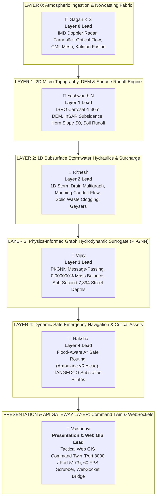

# KAIROS: TEAM ROLE ASSIGNMENTS & LAYER ARCHITECTURE
## Smart India Hackathon 2026 — Problem Statement #26085 (MoES / NCMRWF)
**Beneficiary:** Greater Chennai Corporation (GCC) & TNSDMA  
**Domain:** 426 km², 15 Municipal Zones, 7,894 Road Segments  

---

## 1. Multi-Layer Engineering Architecture & Team Mapping

---

## 2. Detailed Member Layer Breakdown & Responsibilities

### 👤 1. Gagan K S — Lead for Layer 0
* **Assigned Layer:** **Layer 0 (Multi-Sensor Atmospheric Ingestion & Nowcasting Fabric)**
* **Assigned Codebase:** [`ai_service/layer0/`](file:///c:/Users/Gagan%20K%20S/Documents/SIH/ai_service/layer0) (`ingestion.py`, `nowcaster.py`, `calibrator.py`, `cml_ingestor.py`, `fusion.py`, `super_resolution.py`, `disaggregator.py`)
* **Primary Datasets:** `01_Rainfall_Yashwanth/` (IMD Meenambakkam S-Band sweeps, ERA5 winds, AWS rain gauges) & `06_Civic_Maintenance_Gagan/`.
* **Core Technical Responsibilities:**
  1. Live IMD Doppler Weather Radar (SRI/MAXZ) ingestion with zero-crash automated offline fallback.
  2. Farnebäck semi-Lagrangian optical flow tracking $T+15\text{m}$ to $T+180\text{m}$ storm advection ($< 50\text{ms}$).
  3. Commercial Microwave Link (CML) opportunistic rainfall ingestion using ITU-R P.838-3 power-law inversion.
  4. Brandes Log-Gaussian and 2D-Var Kalman spatial data fusion (Gaspari-Cohn polynomial localization).
  5. Mass-conservative spatial disaggregation mapping rainfall intensity onto all 7,894 GCC road corridors.

---

### 👤 2. Yashwanth N — Lead for Layer 1
* **Assigned Layer:** **Layer 1 (2D Micro-Topography, Cartosat DEM & Surface Runoff Engine)**
* **Assigned Codebase:** [`ai_service/layer1/`](file:///c:/Users/Gagan%20K%20S/Documents/SIH/ai_service/layer1) (`dem_builder.py`, `hydro_conditioner.py`, `hydrologic_derivatives.py`, `road_sampler.py`, `lulc/`)
* **Primary Datasets:** `03_Terrain_and_DEM_Vijay/` (Cartosat-1 30m Stereoscopic DEM GeoTIFF, Sentinel-1 InSAR subsidence CSV) & `05_Satellite_Vaishnavi/` (Sentinel-2 LULC, ICAR soils).
* **Core Technical Responsibilities:**
  1. ISRO Cartosat-1 30m DEM mosaicking, UTM 44N planar reprojection, and Sentinel-1 InSAR subsidence offset.
  2. Priority-Flood hydro-conditioning: bridge breaching, stream burning (Cooum/Adyar), and underpass carving (-1.8m at 353 subways).
  3. 8-Neighborhood Horn slope gradient ($S_0$), azimuth aspect, and D8 steepest descent flow accumulation.
  4. LULC impervious area extraction (DCIA fraction), ICAR soil infiltration groups (A, B, C, D), and AMC waterlogging penalties.
  5. Modified Rational surface excess runoff generation ($R_{\text{excess}}$ [mm/hr] and tributary inflow $Q_{\text{surf}}$ [m³/s]).

---

### 👤 3. Rithesh — Lead for Layer 2
* **Assigned Layer:** **Layer 2 (1D Subsurface Stormwater Network Hydraulics & Surcharge Engine)**
* **Assigned Codebase:** [`ai_service/layer2/`](file:///c:/Users/Gagan%20K%20S/Documents/SIH/ai_service/layer2) (`drainage_graph.py`, `clogging_model.py`, `conduit_flow.py`, `inlet_capture.py`, `manhole_surcharge.py`)
* **Primary Datasets:** `02_Drainage_Rithesh/` (CMWSSB pipe diameters, inverts, GCC drainage polyline network, 353 underpass culverts).
* **Core Technical Responsibilities:**
  1. 1D subsurface stormwater multigraph construction (pipe conduits, catch-pits, box culverts, outfalls).
  2. Manning full-pipe conveyance solver ($Q_{\text{cap}}$) for circular pipes and rectangular masonry box drains.
  3. Dynamic solid waste clogging model ($\mu_{\text{clog}} \in [0.05, 0.85]$) driven by zonal waste TPD and canal desilting arrears.
  4. Curb drop-inlet grate capture hydraulics (unsubmerged weir vs submerged orifice) and gutter bypass.
  5. Saint-Venant hydraulic grade line (HGL) tracking and manhole geyser backflow eruption ($Q_{\text{backflow}}$).

---

### 👤 4. Vijay — Lead for Layer 3
* **Assigned Layer:** **Layer 3 (Physics-Informed Graph Hydrodynamic Surrogate — PI-GNN)**
* **Assigned Codebase:** [`ai_service/layer3/`](file:///c:/Users/Gagan%20K%20S/Documents/SIH/ai_service/layer3) (`graph_builder.py`, `surrogate_model.py`, `mass_conservation_loss.py`, `benchmark_validator.py`)
* **Primary Datasets:** 7,894 road network topology, coupled outputs from Layer 1 (DEM runoff) & Layer 2 (conduit backflow).
* **Core Technical Responsibilities:**
  1. Construct the 7,894-node, 162,144-edge directed hydraulic slope adjacency tensor ($\hat{\mathbf{A}}$).
  2. Implement the sub-second PI-GNN relational message-passing surrogate ($< 3\text{ ms}$ CPU inference, $1.64\text{ MB}$ cache fit).
  3. Enforce analytical KKT volumetric mass conservation projection ($\mathcal{P}_{\text{mass}}$) with strict $0.000000\%$ volume error.
  4. Compute multi-horizon water depths ($d_i(t)$) across all 6 lead-time horizons ($T+15\text{m}$ to $T+180\text{m}$).

---

### 👤 5. Raksha — Lead for Layer 4
* **Assigned Layer:** **Layer 4 (Dynamic Safe Emergency Navigation & Critical Assets Safeguarding)**
* **Assigned Codebase:** [`ai_service/layer4/`](file:///c:/Users/Gagan%20K%20S/Documents/SIH/ai_service/layer4) (`routing_engine.py`, `critical_assets_monitor.py`, `risk_cost_evaluator.py`)
* **Primary Datasets:** `04_Historical_Floods_Raksha/` (7,895 flooded road segments, 2015 Deluge depths, TANGEDCO 230kV/110kV substations).
* **Core Technical Responsibilities:**
  1. Water Hazard Potential Field (WHPF) A* dynamic routing engine avoiding submerged underpass bottlenecks.
  2. Multi-vehicle clearance limit enforcement:
     - 🚑 **108 Ambulance:** Clearance limit $= 30\text{ cm}$
     - 🚒 **NDRF Heavy Rescue:** Clearance limit $= 45\text{ cm}$
     - 🚗 **Passenger Car:** Clearance limit $= 18\text{ cm}$
     - 🛵 **Two-Wheeler:** Clearance limit $= 10\text{ cm}$
  3. Real-time plinth flood risk monitoring for 20 high-voltage TANGEDCO substations ($\Delta Z_{\text{plinth}} \le 15\text{ cm}$ warning trigger).
  4. Ground-truth validation against historical 2015 Deluge survey records and Cyclone Michaung.

---

### 👤 6. Vaishnavi — Lead for Presentation & Web GIS Command Twin
* **Assigned Layer:** **Presentation Layer & API Gateway Bridge**
* **Assigned Codebase:** [`frontend/`](file:///c:/Users/Gagan%20K%20S/Documents/SIH/frontend) (`index.html`, `app.html`, `radar_viewer.html`, `dem_viewer.html`, `src/`) & [`backend/`](file:///c:/Users/Gagan%20K%20S/Documents/SIH/backend) (`server.js`)
* **Primary Datasets:** `frontend/data/chennai_flood_data.js`, GeoJSON layers, vector styling.
* **Core Technical Responsibilities:**
  1. Tactical Web GIS Command Twin (CartoDB Dark Matter) & GIGW-compliant national portal theme.
  2. 0–180 minute dynamic time scrubber operating at 60 FPS without DOM re-allocation.
  3. Interactive 5-layer toggles: Radar, DEM, Storm Drains, Flood Inundation Heatmaps, and Evacuation Corridors.
  4. Node.js WebSocket gateway (`ws://localhost:3001` / `5000`) streaming live Python simulation heartbeats to the UI.
  5. Jury demonstration flow, live scenario execution, and pitch walkthrough.

---

## 3. Operational Division of Responsibility

* **GitHub Projects (Web UI):** All task tracking, sprint backlogs, daily checkboxes, and Kanban cards.
* **Repository (Local & Git):** High-precision production code, automated test suites (72/72 passing), and visually attractive Web GIS frontends.
