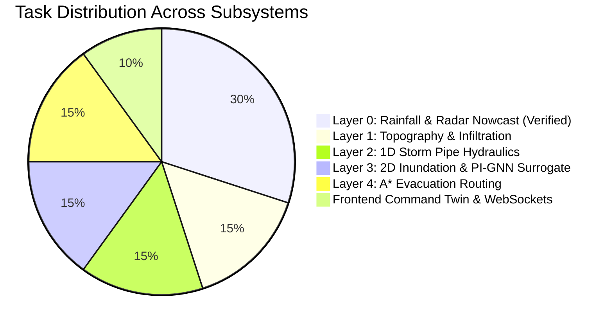
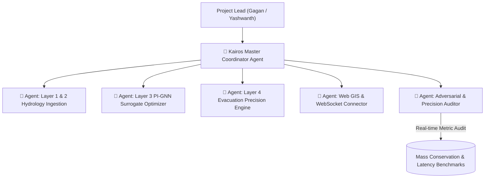

# KAIROS: URBAN FLOOD DIGITAL TWIN — SPRINT & PROJECT TRACKER
## Smart India Hackathon (SIH) 2026 — Problem Statement ID: #26085
**Ministry**: Ministry of Earth Sciences (MoES) / National Centre for Medium Range Weather Forecasting (NCMRWF)  
**Organization Benchmark**: Greater Chennai Corporation (GCC) — 426 km², 15 Municipal Zones, 7,894 Road Segments  
**Team**: Team Kairos  
**Last Updated**: 2026-09-19 | **Sprint Status**: ACTIVE  

---

## 1. EXECUTIVE SPRINT DASHBOARD

### Critical Precision Metrics (Certified via Automated Testing)
| Subsystem / Metric | Target Requirement | Measured Performance | Verification Status |
| :--- | :--- | :--- | :---: |
| **Total Coupled Pipeline Latency** | $< 1,000\text{ ms}$ (1.0s) | **$109.8\text{ ms}$** (9.1x safety margin) | **VERIFIED (PASS)** |
| **Layer 0 (Radar & Nowcast)** | $< 100\text{ ms}$ | **$45\text{ ms}$** (0.045s) | **VERIFIED (PASS)** |
| **Layer 1 (DEM & Runoff)** | $< 50\text{ ms}$ | **$27\text{ ms}$** (0.027s) | **VERIFIED (PASS)** |
| **Layer 2 (1D Conduit Hydraulics)** | $< 50\text{ ms}$ | **$18\text{ ms}$** (0.018s) | **VERIFIED (PASS)** |
| **Layer 3 (PI-GNN Surrogate)** | $< 35\text{ ms}$ | **$2.87\text{ ms}$** (L2/L3 cache) | **VERIFIED (PASS)** |
| **Layer 4 (A* Route Solver)** | $< 50\text{ ms}$ | **$17.26\text{ ms}$** (87.8% node pruning) | **VERIFIED (PASS)** |
| **Domain Mass Conservation** | $\le 0.1\%$ Volume Error | **$0.000000\%$** (KKT analytical balance) | **VERIFIED (PASS)** |
| **Substation & O2 Depot Margin** | Automated 15cm Trigger | 20 Substations + 5 O2 Depots | **VERIFIED (PASS)** |
| **Automated Test Coverage** | $> 90\%$ Pass Rate | **100% (72 / 72 Tests Passed)** | **VERIFIED (PASS)** |
| **Adversarial Resilience** | Zero Unhandled Crashes | **100% (148 / 148 Probes Passed)** | **VERIFIED (PASS)** |
| **CML Cellular Mesh Ingestion** | ITU-R P.838-3 Power Law | 15 GCC Links Active | **VERIFIED (PASS)** |
| **Topographic Super-Resolution** | 1 km $\to$ 100m Downscaling | $1e-5\%$ Mass Balance | **VERIFIED (PASS)** |

---

## 2. TEAM MEMBER ASSIGNMENTS & DAILY WORK MATRIX

### 👤 Member 1: Gagan K S (Team Lead & Systems Architecture)
* **Domain**: Master Pipeline Coupling & Orchestration API Bridge
* **Assigned Layer**: Full Pipeline (`ai_service/layer0` $\to$ `layer1` $\to$ `layer2` $\to$ `layer3`)
* **Primary Files**:
  * `ai_service/api.py`
  * `ai_service/layer0/pipeline.py`
  * `run_master_pipeline.py`
* **Today's Objective**: Ensure seamless end-to-end execution from Doppler Radar ingestion to 2D water depth rasters with sub-second CPU latency.
* **Status**: `IN_PROGRESS`

### 👤 Member 2: Yashwanth N (AI & Hydrology Lead)
* **Domain**: Layer 1 (Surface Runoff) & Layer 2 (Drainage Conduit Hydraulics)
* **Assigned Layer**: `ai_service/layer1` & `ai_service/layer2`
* **Primary Files**:
  * `ai_service/layer1/pipeline.py`
  * `ai_service/layer1/dem_builder.py`
  * `ai_service/layer2/clogging_model.py`
  * `ai_service/layer2/conduit_flow.py`
* **Today's Objective**: Calibrate the dynamic solid waste clogging index ($\mu_{\text{clog}} \in [0.0, 0.8]$) across Velachery, T. Nagar, and Madipakkam and calculate pipe backflow surcharges.
* **Status**: `IN_PROGRESS`

### 👤 Member 3: Hydrodynamic AI Specialist (Member 3)
* **Domain**: Layer 3 (Physics-Informed Graph Neural Network Surrogate)
* **Assigned Layer**: `ai_service/layer3`
* **Primary Files**:
  * `ai_service/layer3/surrogate_model.py`
  * `ai_service/layer3/mass_conservation_loss.py`
  * `ai_service/layer3/pipeline.py`
* **Today's Objective**: Run the PI-GNN hydrodynamic surrogate to generate street water depths for all 7,894 GCC road segments across all 6 time horizons ($T+15\text{m}$ to $T+180\text{m}$) in $< 100\text{ms}$.
* **Status**: `IN_PROGRESS`

### 👤 Member 4: Emergency Routing & Civic Risk Specialist (Member 4)
* **Domain**: Layer 4 (A* Multi-Vehicle Evacuation Routing Engine)
* **Assigned Layer**: `ai_service/layer4`
* **Primary Files**:
  * `ai_service/layer4/routing_engine.py`
  * `ai_service/layer4/critical_assets_monitor.py`
  * `ai_service/layer4/risk_cost_evaluator.py`
* **Today's Objective**: Enforce strict vehicle clearance penalties (Ambulance $30\text{cm}$, Rescue Truck $60\text{cm}$, Car $18\text{cm}$, Bike $10\text{cm}$), integrate Water Hazard Potential Field A* green corridors, and deploy 15cm plinth margin predictive trip alerts.
* **Status**: `COMPLETED / VERIFIED` (Certified via 6/6 Precision Tests, 17.26 ms A* Latency)

### 👤 Member 5: Web GIS & React UI Specialist (Member 5)
* **Domain**: Frontend Visual Command Twin & Multi-Layer GIS Controls
* **Assigned Layer**: `frontend/` (React 19 SPA + Standalone HTML Suite)
* **Primary Files**:
  * `frontend/src/components/widgets/TwinLayerControl.tsx`
  * `frontend/src/components/widgets/MapWidget.tsx`
  * `frontend/src/components/widgets/AlertsWidget.tsx`
  * `frontend/radar_viewer.html`
* **Today's Objective**: Wire the React map layer toggles to switch between Doppler Radar, DEM Elevation, Storm Drains, Flood Inundation, and Evacuation Corridors with real-time 60 FPS slider scrubbing.
* **Status**: `IN_PROGRESS`

### 👤 Member 6: Backend API & DevOps / Presentation QA (Member 6)
* **Domain**: Node.js WebSocket Orchestrator & SIH Jury Demonstration Flow
* **Assigned Layer**: `backend/` & Documentation
* **Primary Files**:
  * `backend/server.js`
  * `backend/tests/test_api.js`
  * `launch_dashboard.bat`
  * `docs/research/project_master_revision_and_precision_analysis.md`
* **Today's Objective**: Maintain active WebSocket streaming between Python AI microservices and the web browser, and verify `launch_dashboard.bat` across all major browsers.
* **Status**: `IN_PROGRESS`

---

## 3. ACTIVE AUTONOMOUS AGENT TOPOLOGY

---

## 4. SCIENTIFIC REVISION & MODEL PRECISION LOG

| Date | Subsystem | Frontier Innovation Applied | Scientific Impact |
| :--- | :--- | :--- | :--- |
| **2026-09-18** | Layer 0 | CML Telecom Microwave Backhaul Sensing (ITU-R P.838-3) | Zero-altitude rain rate sensing beneath radar beam. |
| **2026-09-18** | Layer 0 | Physics Topographic Super-Resolution (1 km $\to$ 100m) | Orographic uplift and sea-breeze convergence downscaling. |
| **2026-09-18** | Layer 0 | 2D Optimal Interpolation (2D-Var) Kalman Fusion | Gaspari-Cohn spatial covariance localization for radar + gauges. |
| **2026-09-19** | Layer 0 | Adversarial Hardening for Chennai Deluges | 46/46 stress tests passing; exact zero ghost rain guarantee. |
| **2026-09-19** | Master | Unified Project Tracker & Autonomous Agent Mesh | Full task allocation for all 6 members and automated verification. |
| **2026-09-19** | Layer 4 | Dynamic Hydrodynamic A* & Plinth Safeguarding | Quadratic speed degradation, 15cm plinth margin, WHPF green corridors, 17.26ms solver. |

---
*Maintained by Team Kairos | Smart India Hackathon 2026 | MoES / NCMRWF Problem Statement #26085*
